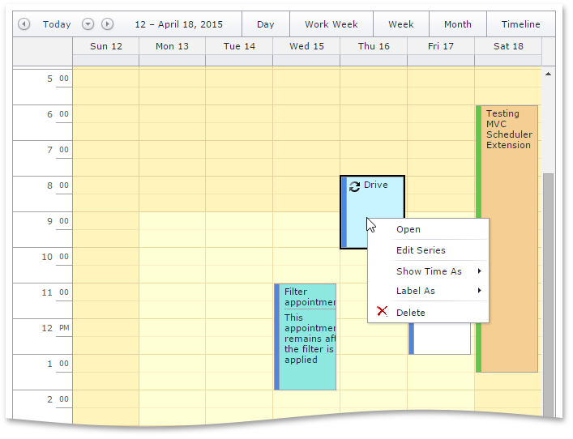

<!-- default badges list -->

<!-- default badges end -->

# Scheduler for ASP.NET MVC - How to implement the insert/update/delete appointment functionality

This example demonstrates how to implement CRUD operations in the [Scheduler](https://docs.devexpress.com/AspNetMvc/11431/components/scheduler) extension.

Refer to the following article for more information: [Lesson 2 - Implement the Insert/Update/Delete Appointment Functionality](https://docs.devexpress.com/AspNetMvc/11567/components/scheduler/get-started/lesson-2-implement-the-insert-update-delete-appointment-functionality)

## Files to Review

* [SchedulerPartial.cshtml](./CS/MVCSchedulerEditable/Views/Home/SchedulerPartial.cshtml)
* [HomeController.cs](./CS/MVCSchedulerEditable/Controllers/HomeController.cs) (VB: [HomeController.vb](./VB/MVCSchedulerEditable/Controllers/HomeController.vb))
* [AppointmentDataAccessor.cs](./CS/MVCSchedulerEditable/Models/AppointmentDataAccessor.cs) (VB: [AppointmentDataAccessor.vb](./VB/MVCSchedulerEditable/Models/AppointmentDataAccessor.vb))

## Documentation

* [Lesson 1 - Display Read-Only Appointments in Scheduler](https://docs.devexpress.com/AspNetMvc/11554/components/scheduler/get-started/lesson-1-use-scheduler-to-display-appointments-in-read-only-mode)
* [Lesson 2 - Edit Data in Scheduler](https://docs.devexpress.com/AspNetMvc/11567/components/scheduler/get-started/lesson-2-implement-the-insert-update-delete-appointment-functionality)
* [Lesson 3 - Use Scheduler in Complex Views](https://docs.devexpress.com/AspNetMvc/11629/components/scheduler/get-started/lesson-3-use-scheduler-in-complex-views)

## More Examples

* [Scheduler for ASP.NET MVC - How to display read-only appointments](https://github.com/DevExpress-Examples/asp-net-mvc-scheduler-display-read-only-appointments)
